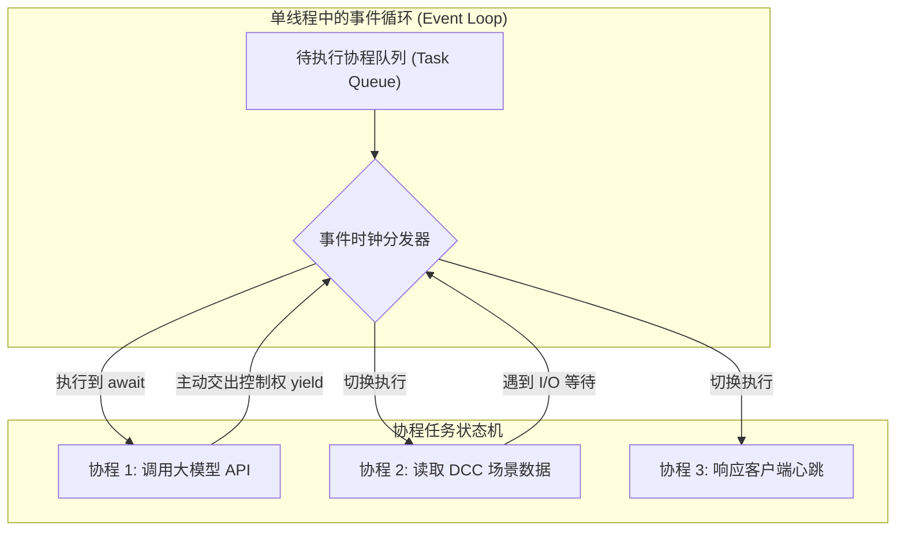

---
title: "Module 12: Asyncio, Event Loop, and Modern Concurrency in Python"
tags:
  - Python
  - Asyncio
  - EventLoop
  - FastAPI
  - Concurrency
  - AI-Agent
  - Pipeline
created: 2026-09-04
module: 12
aliases:
  - Python异步编程
  - EventLoop
  - 协程与async/await
  - FastAPI底层机制
status: completed
---

# Module 12: Asyncio 异步编程、事件循环与生产级并发

> [!summary] 核心学习目标 (Learning Objectives)
> 学完本章后，你应当能够：
> 1. **理解异步编程范式**：深刻体会协作式多任务（Cooperative Multitasking）与操作系统抢占式多任务的本质不同。
> 2. **精通 Asyncio 核心组件**：熟练编写协程函数（`async def`），掌握 `await` 的让步机制，并用 `asyncio.gather()` 和 `create_task()` 实现真正高效的非阻塞并发。
> 3. **打通异步与同步世界（关键技能）**：在遇到阻塞型 I/O 或传统第三方同步库时，熟练运用 `asyncio.to_thread()` 防止事件循环被冻结。
> 4. **掌握异步 + 多进程混合架构**：通过 `ProcessPoolExecutor` 把重度 CPU 计算从主事件循环中剥离。
> 5. **识破死锁与守护线程陷阱**：搞清 Daemon 线程生命周期，掌握避免死锁（Deadlock）的防御性编程规范（带超时机制的 `asyncio.wait_for`）。
> 6. **服务于 AI Agent 与游戏管线**：彻底搞懂为什么 FastAPI、LangGraph 和现代 DCC 外部微服务必须全量拥抱 Asyncio。

---

## 1. 异步编程核心哲学：事件循环（Event Loop）与协程



### 1.1 协作式 vs 抢占式
- **多线程（抢占式 Preemptive）**：操作系统强制在任何时间点把正在运行的线程拍死，换另一个线程上场。不可控，需要大量加锁保护。
- **Asyncio（协作式 Cooperative）**：**单线程运行！** 除非代码自身执行到 `await` 关键字，明确表示*“我这里需要等待外部 I/O，我主动让出执行权，你们先跑”*，否则该函数会一直执行。
- **优势**：没有多线程上下文切换的昂贵内存和内核开销，单个进程可轻松挂载上万个并发连接！

### 1.2 核心三要素代码范式

```python
import asyncio
import time

async def fetch_llm_response(prompt: str, delay: int) -> str:
    print(f"[{time.strftime('%X')}] 发起大模型请求: {prompt}")
    # 必须使用 asyncio.sleep，如果写成 time.sleep 则会把整个事件循环完全冻结！
    await asyncio.sleep(delay)
    return f"模型对 [{prompt}] 的回答完成"

async def main():
    start = time.time()
    
    # 方式 A：创建独立任务并发跑 (Background Tasks)
    task1 = asyncio.create_task(fetch_llm_response("检查 Houdini 节点属性", 2))
    task2 = asyncio.create_task(fetch_llm_response("生成 UE5 材质命名", 3))
    
    # 方式 B：使用 gather 汇聚等待所有结果
    results = await asyncio.gather(task1, task2)
    
    for res in results:
        print(f"收到结果 -> {res}")
        
    print(f"总耗时: {time.time() - start:.2f} 秒 (而不是 2+3=5 秒)")

if __name__ == '__main__':
    asyncio.run(main())
```

---

## 2. 混合架构：Asyncio 中混用多线程（Mixing Threads）

> [!danger] 致命事故场景
> 很多新手在 FastAPI 或异步 Agent 中直接调用了同步库，例如：
> `requests.get(...)`、读取大贴图文件、或者调用了 Houdini 的同步 Python API。
> **结果**：整个服务所有的异步并发全部卡死！因为单线程的事件循环被你的同步耗时阻塞代码霸占了！

### 解决办法：`asyncio.to_thread`（Python 3.9+ 黄金标准）
将阻塞的同步任务推入后台的线程池中执行，同时允许事件循环继续调度其他协程：

```python
import asyncio
import time

def blocking_sync_file_io(filepath: str) -> int:
    """模拟一个耗时的同步文件解析操作 (例如读取大型 FBX 或 USD 场景)"""
    print(f"开始同步读取: {filepath}")
    time.sleep(2)  # 同步阻塞
    return 1024

async def main():
    print("准备调度同步任务...")
    # asyncio.to_thread 内部会自动借用 ThreadPoolExecutor 运行，且返回可 await 的协程
    result = await asyncio.to_thread(blocking_sync_file_io, "character_hero.fbx")
    print(f"异步等待完成，解析节点数: {result}")

if __name__ == '__main__':
    asyncio.run(main())
```

---

## 3. 异步 + 多进程：处理 CPU 密集型任务

当你的 AI 业务既需要**高并发异步网络通信**，又需要**高强度 CPU 矩阵计算**时：

```python
import asyncio
from concurrent.futures import ProcessPoolExecutor
import math

def heavy_cpu_crunch(n: int) -> int:
    """纯 CPU 密集运算 (不受 GIL 干扰的多进程计算)"""
    return sum(math.isqrt(i) for i in range(n))

async def main():
    loop = asyncio.get_running_loop()
    
    # 构建进程池
    with ProcessPoolExecutor() as pool:
        # 将 CPU 密集型计算任务下发到独立物理核心进程
        result = await loop.run_in_executor(pool, heavy_cpu_crunch, 10_000_000)
        print(f"计算结果: {result}")

if __name__ == '__main__':
    asyncio.run(main())
```

---

## 4. 守护线程 vs 非守护线程（Daemon vs Non-Daemon）

| 线程类型 | 启动方式 | 特性与生命周期 | 适用场景 |
| :--- | :--- | :--- | :--- |
| **非守护线程 (Non-Daemon)** | 默认状态 (`daemon=False`) | 主线程执行完毕后，**必须等待**所有非守护线程结束，Python 进程才会退出。 | 关键写入任务、数据库事务提交、资产保存 |
| **守护线程 (Daemon)** | `t.daemon = True` | 主线程一旦退出，**所有守护线程瞬间被强制杀死**，即使任务还没跑完。 | 后台心跳保活检测、内存监控、垃圾自动清理 |

> [!caution] 避坑警示
> 永远不要在 Daemon 线程中打开关键数据库连接或进行重要文件的写盘操作，因为进程退出时它会被系统突兀掐断，可能导致写入的文件变成半截损坏的脏数据！

---

## 5. 死锁（Deadlock）防御与安全模式

在异步编程中，当两个协程互相持有对方需要的资源（如 `asyncio.Lock`）时，就会出现死锁。

### 防御黄金法则：带超时的 `wait_for`
永远不要无休止地等待一把锁，必须给关键资源抢占加上**超时熔断**：

```python
import asyncio

lock_a = asyncio.Lock()

async def safe_resource_access():
    try:
        # 给获取锁设置 3 秒超时限制
        async with asyncio.timeout(3.0):  # Python 3.11+ 原生语法
            async with lock_a:
                print("成功抢占锁并执行核心逻辑")
    except TimeoutError:
        print("警告：获取资源超时，主动放弃并进行异常回滚，成功避免无限死锁！")
```

---

## 6. 游戏开发与 AI Agent 管线深度串联

> [!important] 工业界知识点闭环：
> 1. **FastAPI 的底色**：FastAPI 的路由函数之所以推荐写成 `async def my_endpoint(...)`，正是因为底层基于这套 Asyncio 事件循环。当成百上千个游戏客户端同时向 Agent 发送对话或心跳时，FastAPI 不会为每个请求傻傻开一个笨重的系统线程，而是把所有网络等待全都由一个事件循环优雅管理。
> 2. **多工具并发调用 (Agent Tool Calling 并行化)**：
>    - 在开发 DCC 智能体时，用户说：“*帮我检查场景中缺少贴图的模型，同时查询一下最近 3 天资产库更新的材质*”。
>    - 聪明的 Agent 可以同时触发两个 Tool：
>      `results = await asyncio.gather(check_scene_textures(), query_asset_library_rag())`
>    - 串行需要 6 秒的任务，异步并发只需 3 秒完成！

---

## 7. 关联双向链接 (Obsidian Links)
- [[11-MultiThreading-Multiprocessing-GIL|上一章：Module 11 多线程、多进程与 GIL]]
- [[13-Pydantic-Data-Validation|下一章：Module 13 Pydantic 强类型契约与参数校验]]
- [[FastAPI-and-Async-Web-Architecture|FastAPI 高并发系统设计]]
- [[DCC-MCP-Bridge-Design|DCC 桥接与长连接设计]]
