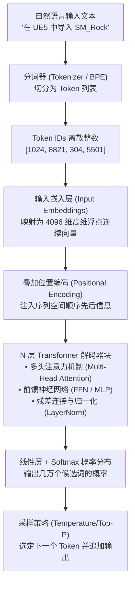
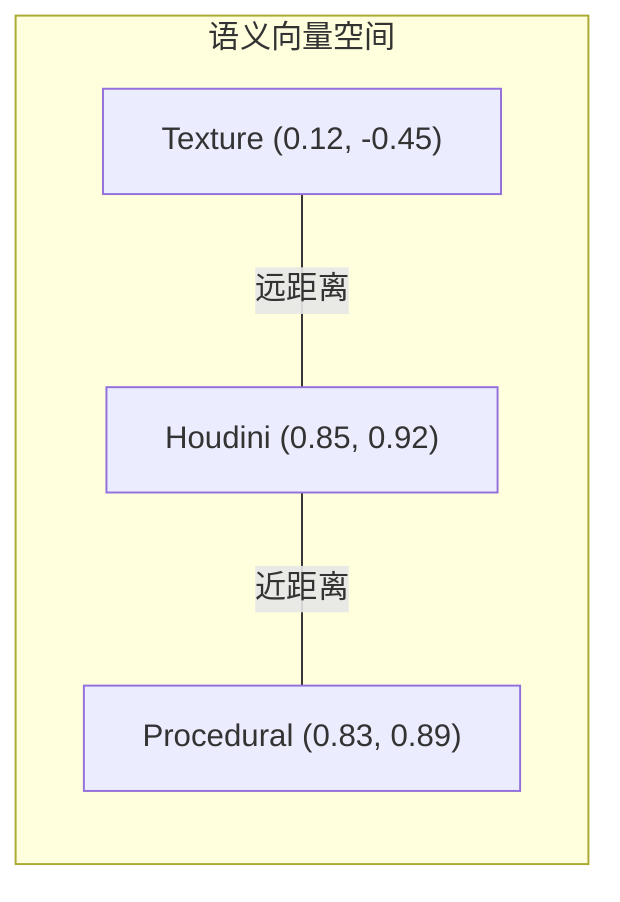

# Module 14: 大语言模型底层原理完全剖析

> [!summary] 核心学习目标 (Learning Objectives)
> 学完本章后，你应当能够：
> 1. **还原完整黑盒流程**：画出自然语言从文本输入到大模型输出下一个 Token 的全生命链路图。
> 2. **透彻理解 Tokenization**：搞清楚字符、单词与子词（BPE / Byte-Pair Encoding）分词机制，解释为何代码缩进与数字计算容易消耗更多 Token。
> 3. **掌握高维向量嵌入 (Vector Embeddings)**：理解语义空间的几何意义，熟练使用点积（Dot Product）与余弦相似度（Cosine Similarity）进行语义匹配（RAG 核心基石）。
> 4. **吃透注意力机制 (Self-Attention)**：用经典“数据库检索比喻”讲透 Query、Key、Value 的数学本质与缩放点积注意力公式。
> 5. **讲清位置编码 (Positional Encoding)**：解释为什么 Transformer 天生丧失序列顺序信息，必须引入正弦或 RoPE（旋转位置编码）。
> 6. **服务于游戏管线 (TA 实战映射)**：搞懂为何大模型上下文长度（Context Window）直接受限于注意力计算复杂度，以及如何评估 RAG 知识库切分对 Token 消耗的影响。

---

## 1. 宏观鸟瞰：大模型从输入到输出的流水线全景

大语言模型（LLM）的本质是一个**“下一个 Token 预测机器（Next-Token Predictor）”**。输入一段文字，模型预测下一个概率最大的词，然后追加到末尾，像贪吃蛇一样自回归（Autoregressive）循环往复。

---

## 2. 第一道工门：分词（Tokenization）与 BPE 算法

大模型无法直接读懂字符串字符，计算机只能处理数字。

### 2.1 三种分词策略对比
1. **按字符（Character-level）**：每个字母/汉字是一个 Token。
   - *缺点*：序列极长，模型上下文迅速撑爆，且单个字母缺乏语义。
2. **按单词（Word-level）**：按空格分词（如 `import`、`unreal`、`houdini`）。
   - *缺点*：词表无限庞大（OOV / Out-Of-Vocabulary 灾难），遇到没见过的拼写或合成词直接报错。
3. **子词分词（Subword / BPE - 工业界标准）**：
   - 常见的高频词作为完整单词保留（如 `model`）；
   - 罕见词或复合词拆分为子词块（如 `UnrealEngine` -> `["Unreal", "Engine"]`）。

> [!important] 为什么编写代码对 Token 很敏感？
> 代码中的缩进（4 个空格）、特殊符号（下划线 `_`、冒号 `:`）以及生僻的变量命名（如 `geo_attrib_val`），经常会被 BPE 分词器切碎成 3~5 个小 Token。
> **因此，冗余冗长的代码会快速吃满大模型的 Context Window，这也是为什么提示词工程强调“简洁精炼”的原因！**

---

## 3. 语义的高维空间投影：向量嵌入（Vector Embeddings）

Token ID（如 `1024`）只是一个代号，并没有数学上的“距离”含义（`1025` 并不代表语义和 `1024` 接近）。
**嵌入层（Embedding Layer）的作用，是把每一个离散数字投影到一个高维向量空间（通常为 1536 维、4096 维）。**

### 3.1 语义几何与相似度计算（RAG 的数学底座）
在这个高维空间中，**语义相近的词，其空间向量的方向和距离也高度靠近**：
- 经典等式：$Vector("King") - Vector("Man") + Vector("Woman") \approx Vector("Queen")$
- 游戏管线等式：$Vector("Houdini") - Vector("Procedural") + Vector("Realtime") \approx Vector("UnrealEngine")$

### 3.2 余弦相似度公式（Cosine Similarity）
在阶段 2 构建 RAG 知识库检索时，最核心的相似度度量就是余弦相似度：
$$\text{Cosine Similarity}(A, B) = \frac{A \cdot B}{\|A\| \|B\|} = \frac{\sum_{i=1}^{n} A_i B_i}{\sqrt{\sum_{i=1}^{n} A_i^2} \sqrt{\sum_{i=1}^{n} B_i^2}}$$
- 值为 **1**：完全同向（语义完全相同）；
- 值为 **0**：相互正交（毫不相关）；
- 值为 **-1**：完全反向。

---

## 4. 灵魂核心：注意力机制（Attention Is All You Need）

在 2017 年 Google 提出 Transformer 之前，NLP 普遍使用 RNN（循环神经网络）或 LSTM。
- **RNN 致命缺陷**：必须像穿羊肉串一样挨个词依次读取，无法在 GPU 上并行训练，且长句子后半段会完全遗忘前面的内容（梯度消失）。
- **Transformer 的创举**：**Self-Attention（自注意力机制）**，让序列里的每一个词在同一时刻能够“看到”其他所有的词，并计算权重关联！

### 4.1 核心公式：Q、K、V 的图书馆借阅比喻
$$\text{Attention}(Q, K, V) = \text{softmax}\left(\frac{Q K^T}{\sqrt{d_k}}\right) V$$

| 矩阵 | 英文名称 | 直观比喻 | 现实场景对应 |
| :--- | :--- | :--- | :--- |
| **$Q$** | **Query（查询）** | 你走进图书馆在检索框输入的搜索词 | 当前正在关注的词：“*这个模型*” |
| **$K$** | **Key（键 / 索引）** | 每本书书脊上的标签和分类号 | 上下文中所有词的特征索引 |
| **$V$** | **Value（值 / 内容）** | 每本书封面里的真实正文知识 | 每个词携带的真实语义信息 |

1. **$Q K^T$（点积打分）**：拿你的查询去和所有书的标签做乘法，算出一个相关度分数；
2. **$\div \sqrt{d_k}$（缩放因子）**：防止高维度下数值过大导致 Softmax 梯度消失；
3. **$\text{softmax}(\dots)$（权重归一化）**：转为总和为 100% 的注意力概率分布；
4. **$\times V$（加权求和）**：根据权重把所有书的内容混合融合在一起，生成当前词融合了全局上下文的新表示！

### 4.2 多头注意力（Multi-Head Attention）
为什么叫“多头（Multi-Head）”？
因为单一注意力只能关注一种关系。多头机制相当于**有 8 个或 32 个并行的“观察者”同时在看这句话**：
- 头 1：专门观察**主谓宾语法关系**；
- 头 2：专门观察**代词指代（比如“它”到底指代哪个游戏资产）**；
- 头 3：专门观察**上下文修饰词与否定词**。
最后把所有头的观察结果拼接（Concat）在一起，得到极度丰富的语义表达。

---

## 5. 位置编码（Positional Encoding）：打破时空混乱

由于 Attention 公式是对所有词做加权点积，如果把一句话的词语全部打乱重排，数学结果是完全相同的（即**置换不变性 Permutation Invariant**）。
为了让模型分清“*在 Houdini 中导出到 UE5*”和“*在 UE5 中导出到 Houdini*”，必须在输入嵌入时叠加**位置编码（Positional Encoding）**，将词在句子中的先后物理顺序以正弦波（Sinusoidal）或现代旋转位置编码（RoPE）的形式编码进向量。

---

## 6. 游戏开发与 AI Agent 架构的深度映射

> [!important] 为什么理解 Module 14 能拯救你的游戏 AI 管线？
> 1. **为什么 Agent 会“读不懂大文件”？**
>    - 自注意力机制的计算复杂度是 $O(N^2)$（与上下文长度的平方成正比）。输入 1 万行未精简的 DCC 日志，模型的显存占用和计算时间会呈指数级飙升。
>    - **工程对策**：在喂给 Agent 之前，必须通过切块与关键行正则过滤，严控输入上下文大小。
> 2. **为阶段 2 的 RAG 奠定数学基础**：
>    - 当我们把 Unreal Engine API 文档存入 Chroma / Pinecone 时，背后调用的就是本章讲的 **Embedding 向量化**；
>    - 当用户提问时，向量数据库在背后做的就是 **Cosine Similarity 余弦点积匹配**，挑出最相似的 API 知识片段注入 Prompt。

---

## 7. 自我检测与闪卡 (Flashcards)

- **Q1: 为什么现在的绝大多数大模型（如 GPT-4、Llama 3、Qwen、Gemma）都采用 Decoder-Only 架构，而不是完整的 Encoder-Decoder？**
  - *Answer*: 因为纯自回归（Causal Masked Decoder）架构在海量无监督文本预测下一个 Token（Next-Token Prediction）时训练效率最高，涌现通用推理能力最强，并且极易在统一的框架下完成对话、写代码、多轮交互。
- **Q2: 向量数据库检索和传统 MySQL 的关键词 `LIKE %xxx%` 查询有什么本质区别？**
  - *Answer*: 关键词模糊查询是基于**字面字符匹配**，如果用户搜“游戏资产”而文档里写的是“静态网格体”，关键词查询完全失效；而向量检索基于**语义高维空间几何距离**，即使字面上没有重合汉字，因为在高维空间内夹角小（余弦相似度高），也能精准检索召回。
