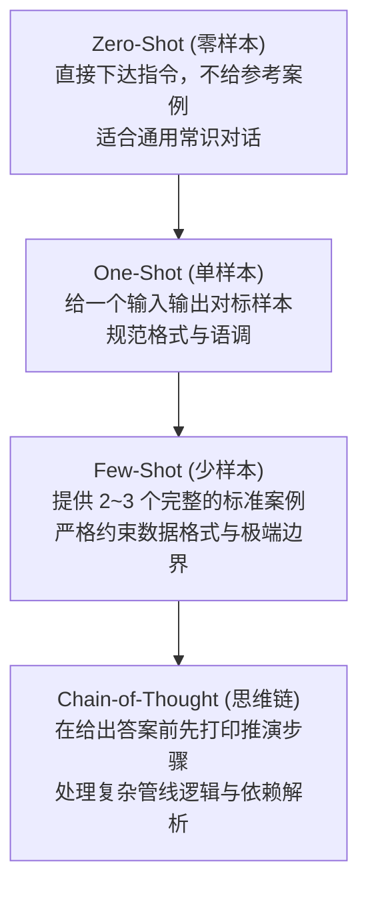
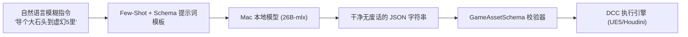

---
title: "Module 16 & 17: 高级提示词工程与指令序列化格式 (Prompt Engineering & Serialization)"
tags:
  - PromptEngineering
  - FewShot
  - ChainOfThought
  - ChatML
  - LocalLLM
  - Pydantic
  - GamePipeline
created: 2026-09-04
module: 16-17
aliases:
  - 提示词工程
  - Few-Shot少样本提示
  - 思维链CoT
  - 提示词序列化格式
status: in-progress
---

# Module 16 & 17: 高级提示词工程与指令序列化格式完全手册

> [!summary] 核心学习目标 (Learning Objectives)
> 学完本章后，你应当能够：
> 1. **精通提示词类型谱系**：熟练运用 Zero-Shot（零样本）、One-Shot（单样本）、Few-Shot（少样本）引导本地开源大模型输出确定性结果。
> 2. **掌握结构化输出引导**：在不依赖闭源 API 专属特性的情况下，通过 Few-Shot 样本教会本地开源模型（如 Qwen / Gemma）稳定输出合法 JSON。
> 3. **运用思维链 (Chain-of-Thought / CoT)**：掌握显式推理引导法则（"Let's think step by step"），解决游戏管线中复杂的资产依赖和节点连线推演。
> 4. **掌握角色人设工程 (Persona-based Prompting)**：构建具有高精度技术美术（TA）上下文的 System Prompt。
> 5. **理解大模型指令序列化格式 (Module 17)**：
>    - **Alpaca 格式** (`### Instruction:`, `### Input:`, `### Response:`)
>    - **ChatML 格式** (`<|im_start|>system ... <|im_end|>`)
>    - **LLaMA [INST] 格式** (`[INST] <<SYS>> ... <</SYS>> [/INST]`)
>    - 理解不同模型家族的分词特殊标记（Special Tokens）。

---

## 1. 提示词类型演进与本地模型实操

对于云端大模型（如 GPT-4o），其指令对齐极强，往往 Zero-Shot 就能猜准你的意图；
**但对于本地大模型（如 7B/14B/26B），Few-Shot（少样本示例）是确保输出 100% 稳定的核心法宝！**



### 1.1 Zero-Shot vs Few-Shot 代码实战模式

#### ❌ 脆弱的 Zero-Shot（本地模型容易自由发挥）：
```text
System: 你是一个游戏管线助手。
User: 把场景里的岩石模型重命名并放到 Meshes 目录。
```
*结果*：模型可能输出一大堆客套话：“好的！为您找到以下方法，在 Unreal Engine 中...”，夹杂了大量无用废话，导致下游 Python 代码解析崩溃。

#### ✅ 工业级 Few-Shot（提供 2 个样板，本地模型瞬间对齐）：
```text
System: 你是一个严格输出 JSON 的游戏资产解析器，不得输出任何多余废话。

User: 导入一个木箱贴图，尺寸 2048
Assistant: {"asset_type": "Texture", "asset_name": "T_WoodBox", "format": "png", "max_resolution": 2048}

User: 创建一个英雄石雕模型
Assistant: {"asset_type": "StaticMesh", "asset_name": "SM_HeroStatue", "format": "fbx"}

User: 导入一个大岩石模型，放在原点
Assistant:
```
*结果*：本地模型会像听话的打字机一样，直接续写出标准 JSON，干净利落！

---

## 2. 思维链 (Chain-of-Thought / CoT)：让模型先想后写

在处理复杂的 TA 管线逻辑时（例如：“*在 Houdini 中根据高程差给地形分层赋予岩石和草地材质*”），直接让模型写代码往往会漏掉关键属性。

### CoT 的三大推进阶段
1. **分析意图与约束 (Analysis & Constraints)**
2. **算法逻辑推演 (Step-by-Step Logic Planning)**
3. **最终代码与参数交付 (Final Deliverable)**

通过在 Prompt 中要求：
> *"在给出最终 JSON 或代码前，请在 `<thought>` 标签内简要列出你的推导依据和前置条件。"*

**能够将本地大模型的逻辑准确率提升 40% 以上！**

---

## 3. 指令序列化底层格式 (Instruction Formats)

不同大模型在预训练和 SFT（监督微调）时，所投喂的文本格式是不同的。如果输入格式不匹配，模型可能会“失控胡言乱语”。

### 3.1 常见三大工业标准模板

#### A. ChatML 格式（OpenAI / Qwen 系列标准）
```text
<|im_start|>system
你是一名资深游戏管线技术美术 (TA)。<|im_end|>
<|im_start|>user
如何用 Python 获取当前打开关卡的名字？<|im_end|>
<|im_start|>assistant
使用 unreal.EditorLevelLibrary.get_editor_world().get_name() 即可。<|im_end|>
```

#### B. LLaMA 2 / 3 [INST] 格式
```text
[INST] <<SYS>>
你是一名资深游戏管线技术美术 (TA)。
<</SYS>>

如何用 Python 获取当前打开关卡的名字？ [/INST]
```

#### C. Alpaca 格式（早期 Stanford 开源指令经典）
```text
### Instruction:
解析以下自然语言并输出规范的游戏资产命名。

### Input:
创建一个角色武器大剑模型

### Response:
SM_Weapon_GreatSword_01
```

> [!important] 为什么 Ollama 很省心？
> Ollama 的底层 Modelfile 会自动把你的 `messages=[{"role": "user", "content": "..."}]` 翻译映射为目标模型对应的 `ChatML` 或 `[INST]` 格式，免去了手动拼接特殊标记的烦恼！

---

## 4. 与 Pydantic (Module 13) 的终极联动

提示词工程的终点，就是将非结构化的用户语言，**无缝映射进强类型的 Pydantic 数据契约中**：



---

## 5. 关联双向链接 (Obsidian Links)
- [[13-Pydantic-Data-Validation|上一章：Module 13 Pydantic 强类型数据契约]]
- [[14-Core-Foundations-of-Generative-AI|上一章：Module 14 大模型底层原理与 Token 机制]]
- [[20-Building-AI-Agents|后续章节：Module 20 构建自主 AI Agent 智能体]]
