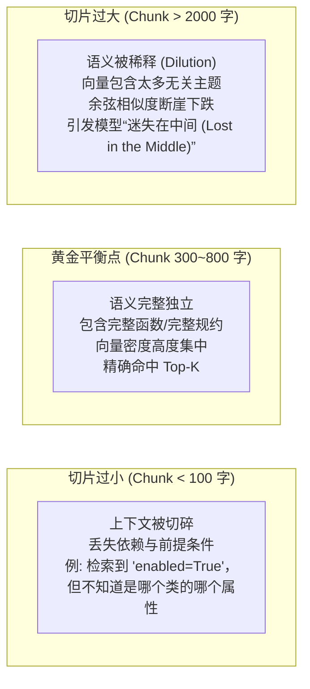
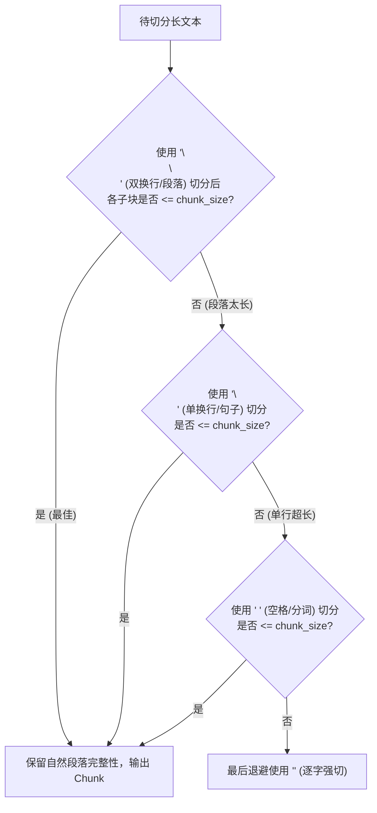

# 📚 Module 22: 高级文本切片策略 (Chunking) 与元数据工程 (Metadata)

> **核心目标**：攻克 RAG 系统中最容易被忽视、却直接决定生成质量生死的关键工序 —— **文档切片（Chunking）与元数据富集（Metadata Enrichment）**。解决游戏研发中数百页《美术规范圣经》与复杂 UE5 Python 源码在切片时的上下文撕裂与语义断裂问题。

---

## 🎯 一、为什么切片是 RAG 的“生命线”？（金发姑娘问题）

在游戏知识库构建中，很多初学者会问：*“我们大模型的上下文窗口都支持 32k 甚至 128k 了，为什么不把整篇《UE5 渲染与资产规范手册.md》（共 40,000 字）直接塞给大模型？”*

这就是典型的 **RAG 质量陷阱**：



### 切片尺寸的“金发姑娘原则 (Goldilocks Principle)”：
1. **切片过大（Too Big）**：
   - **语义稀释（Semantic Dilution）**：一段 2000 字的文本同时讲了“贴图格式”、“LOD 预算”、“骨骼绑定”三个主题，其生成的 Embedding 向量成了“四不像”，导致无论搜什么相似度都偏低。
   - **中间迷失（Lost in the Middle）**：长上下文虽然装得下，但大模型对头部和尾部信息敏感，位于中段的私有规则会被注意力机制忽略。
2. **切片过小（Too Small）**：
   - **上下文撕裂（Context Fragmentation）**：一个 50 字的切片只包含一句 `task.options = options`，丢失了上面的 `task = unreal.AssetImportTask()`，大模型拿到后根本无法写出可运行的代码。

---

## 🛠️ 二、四大工业级切片策略横向对比与选型

针对游戏工作室的各种文档类型，我们必须选用不同的切片武器：

| 切片策略 | 底层原理 | 适用场景 | 游戏管线典型案例 |
| :--- | :--- | :--- | :--- |
| **1. 固定长度切片<br>(Character / Token)** | 按固定字符数或 Token 数硬切，辅以滑动窗口 | 纯文本、无明显排版结构的流水账日志 | Perforce 提交历史、引擎构建编译 Log |
| **2. 递归字符切片<br>(Recursive Character)** | 按照分隔符优先级列表逐层退避切分 | **通用文档首选**、段落清晰的技术文档 | 虚幻引擎 Wiki、TA 经验分享踩坑帖 |
| **3. Markdown 结构切片<br>(Markdown Header)** | 识别 `# 一级标题`、`## 二级标题` 层级进行语义块切分 | **工作室美术规范首选**、SOP 文档 | 《项目美术规范圣经》、《LOD 预算分配方案》 |
| **4. 代码语义 AST 切片<br>(PythonCodeTextSplitter)** | 识别代码语法边界（`class`、`def`、缩进块） | **DCC 自动化源码首选**、Cookbook | UE5 Python 官方库、Maya 货架工具源码 |

---

## ⚡ 三、深度剖析：递归字符切片器 (Recursive Character Splitter)

### 1. 分隔符退避哲学 (Graceful Degradation)
`RecursiveCharacterTextSplitter` 为什么是通用文本的黄金标准？因为它**尽可能保留段落与语义的自然结构**。
它内部维护了一组带优先级的默认分隔符：
```python
separators = ["\n\n", "\n", " ", ""]
```



---

## 📑 四、结构化切片：MarkdownHeaderTextSplitter 的降维打击

游戏项目规范通常是用 Markdown 编写的（如 Obsidian、Notion、GitHub Wiki）。
如果用常规切片器切分下面这篇文档：
```markdown
# 虚幻5渲染管线规范
## 贴图规范
### 法线贴图
必须禁用 sRGB，且压缩格式设置为 TC_Normalmap。
```
常规切片器会把最后一句单独切成一个 Chunk：
> *"必须禁用 sRGB，且压缩格式设置为 TC_Normalmap。"*

**灾难发生了**：这个 Chunk 里**没有任何“贴图”或“法线”这两个词**！当用户搜索“法线贴图该怎么设”时，向量检索根本搜不到这条规则！

### MarkdownHeaderTextSplitter 的解法（面包屑元数据注入）：
它会将文档的大纲标题层级，**自动提取并写入每个 Chunk 的 Metadata 中**：
- **Chunk 内容**：`"必须禁用 sRGB，且压缩格式设置为 TC_Normalmap。"`
- **自动绑定的 Metadata**：
  ```json
  {
    "Header 1": "虚幻5渲染管线规范",
    "Header 2": "贴图规范",
    "Header 3": "法线贴图"
  }
  ```
检索时，元数据与正文结合，上下文完整度达到 100%！

---

## 💻 五、代码专属切片：PythonCodeTextSplitter

在处理游戏 Python 脚本时，绝不能破坏函数的完整性。
`PythonCodeTextSplitter` 是专门针对 Python 语法定制的递归切片器，其内置分隔符为：
```python
separators = [
    "\nclass ",      # 优先按类切分
    "\ndef ",        # 其次按独立函数切分
    "\n\tdef ",      # 再次按类内部方法切分
    "\n\n",          # 段落
    "\n",            # 单行
    " "              # 空格
]
```
这保证了：**任何一个 UE5 操作函数（包含它的 def 声明、形参类型注解、Docstring 注释与内部实现）绝不会被从腰部切断！**

---

## 🔄 六、滑动窗口重叠率 (Chunk Overlap) 的数学设计

切片时必须配置重叠窗口（Overlap）：

$$\text{有效推进步长 (Stride)} = \text{Chunk Size} - \text{Chunk Overlap}$$

```
[ Chunk 1: Token 0 ~ 500 ]
              [ Chunk 2: Token 400 ~ 900 ]  <-- 重叠 100 Token
                            [ Chunk 3: Token 800 ~ 1300 ]
```

> [!TIP]
> **游戏管线切片黄金参数经验值：**
> * **技术规范文档（SOP）**：`chunk_size = 500 ~ 800 字符`, `chunk_overlap = 80 ~ 120 字符` (约 15% 重叠率)。
> * **Python / C++ 代码库**：`chunk_size = 1000 ~ 1500 字符`, `chunk_overlap = 150 ~ 200 字符` (保障函数引用完整性)。
> * 重叠率过低（<5%）：边界处的判定条件（如 `if ... else`）容易被断开；
> * 重叠率过高（>30%）：向量库产生大量重复冗余，浪费索引空间并导致 Top-K 召回完全相同的内容。

---

## 🏷️ 七、元数据工程（Metadata Schema）与前置过滤

在将 Chunk 灌入向量数据库之前，务必进行**元数据富集（Metadata Enrichment）**。

### 工业级 DCC 元数据模板：
```python
metadata_schema = {
    # 1. 软件环境维度 (防串台)
    "software": "UnrealEngine",           # "UnrealEngine" | "Maya" | "Houdini"
    "engine_version": "5.4",              # 锁定版本
    
    # 2. 知识分类维度 (精准缩小检索面)
    "category": "API_Cookbook",            # "Naming_SOP" | "API_Cookbook" | "Troubleshooting"
    "module": "StaticMesh",               # "StaticMesh" | "Texture" | "Material" | "Niagara"
    
    # 3. 权威性与溯源维度
    "source_file": "ue5_importer.py",
    "breadcrumb": "资产导入 > 网格体 > Nanite设置",
    "verified_by_ta": True                # 标记该代码是否在真机上验证跑通过
}
```

在执行 RAG 检索时，**元数据前置过滤（Pre-Filtering）** 可以让耗时大幅下降，且准确率达到 100%：
```python
# 混合过滤检索：只在 UE5 5.4 的官方已验证 API 中做向量搜索
collection.query(
    query_texts=["如何开启 Nanite"],
    n_results=2,
    where={
        "$and": [
            {"software": "UnrealEngine"},
            {"verified_by_ta": True}
        ]
    }
)
```

---

## 🚀 总结与实战演练预告

- **通用文本用 Recursive**；
- **美术圣经用 MarkdownHeader**；
- **脚本工具用 PythonCode**；
- **元数据富集是杜绝“跨软件、跨版本 API 污染”的最强护城河！**

👉 **下一步实战**：我们将通过 Python 编写切片实验室脚本，模拟一份长篇真实的《工作室 UE5 美术资产与脚本综合规范手册》，分别使用这几种切片器进行切片压测与元数据比对！
