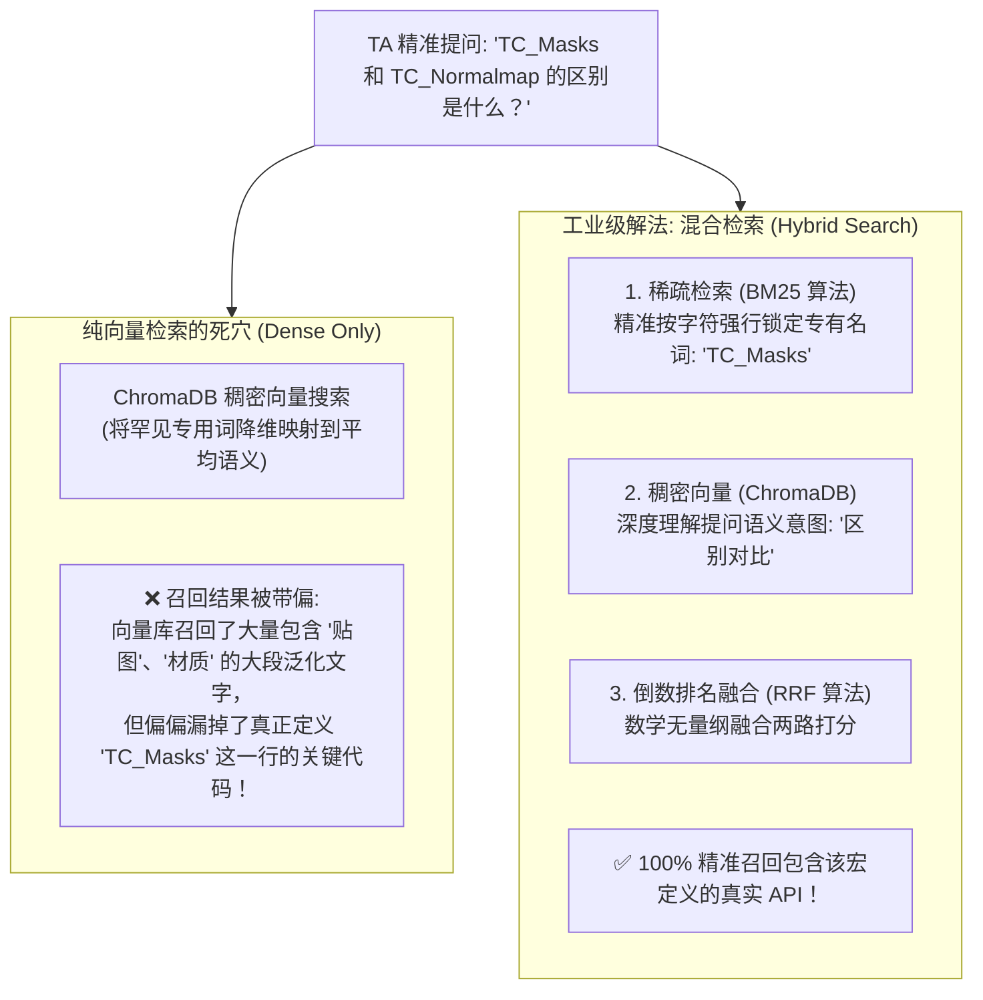
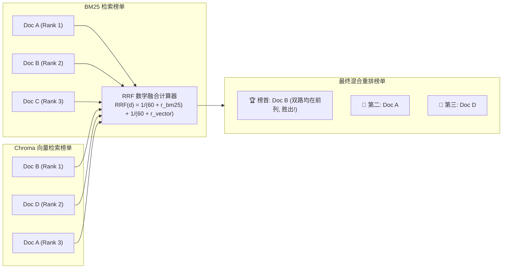

# 📚 Module 23: 混合检索 (Hybrid Search) 与倒数排名融合 (RRF)

> **核心目标**：攻克游戏研发 RAG 场景中最严峻的“专有名词与 API 符号检索失效”难题。将经典的 **BM25 稀疏关键字检索 (Sparse)** 与 **ChromaDB 稠密向量检索 (Dense)** 强强联合，运用 **倒数排名融合算法 (Reciprocal Rank Fusion, RRF)** 实现 100% 毫无偏差的双轨精准召回。

---

## 💥 一、游戏工业界痛点：为什么纯向量检索（Dense Only）频频翻车？

在通用聊天场景中，纯向量语义检索表现良好。然而，在**游戏技术美术 (TA) 与引擎开发管线**中，用户的提问具有极高密度的**精准专有名词、API 类名与枚举宏定义**：

### 纯向量检索（Dense Retrieval）在游戏管线中的三大短板：
1. **OOD（Out of Distribution）专有名词失真**：
   预训练 Embedding 模型（如 `all-MiniLM-L6-v2` 或 OpenAI `text-embedding-3`）是在通用互联网语料上训练的，它们根本不理解 `_ORM`、`WBP_`、`TC_Normalmap`、`unreal.FbxImportUI` 是什么，只能将其当作“低频噪音词”处理。
2. **关键词重要性被长上下文稀释**：
   一句话即使包含了关键类名 `AssetImportTask`，如果周围充斥着大量泛化解释词，向量距离就会被泛化词平均掉。
3. **冷启动与私有 API 盲区**：
   对于工作室自研工具（如 `MyStudioHDA_Exporter`），通用嵌入模型完全没有先验语义。

---

## ⚔️ 二、双轨检索武器横向决选：Dense vs Sparse

| 检索维度 | 稠密向量检索 (Dense Retrieval) | 稀疏关键词检索 (Sparse - BM25) | 混合检索 (Hybrid Search) |
| :--- | :--- | :--- | :--- |
| **底层算法** | 余弦相似度 (Cosine) / HNSW 图 | 词频-逆文档频率 (TF-IDF / BM25) | **双路并行召回 + RRF 融合** |
| **擅长领域** | **模糊意图、同义词理解** (如搜“怎么让模型变轻”命中“LOD 减面”) | **精准专有名词、API 符号、缩写** (如搜“`TC_Masks`”、“`SM_`”、“`fbx`”) | **两者兼得，全场景无死角** |
| **致命短板** | 精确专有名词易被带偏、漏召回 | 无法理解近义词与上位概念（搜“减面”搜不到“LOD”） | 需维护两套索引，检索链路稍长 |
| **游戏管线表现** | 适合泛需求（如“帮我写个材质工具”） | 适合查手册（如“`unreal.EditorAssetLibrary`”） | **工业级生产管线唯一推荐方案** |

---

## 📐 三、BM25 算法底层数学原理剖析

BM25（Best Matching 25）是信息检索界历经 30 年考验的常青树算法，它是 TF-IDF 的集大成改良版。

### 核心公式：
$$\text{Score}(D, Q) = \sum_{i=1}^{n} \text{IDF}(q_i) \cdot \frac{f(q_i, D) \cdot (k_1 + 1)}{f(q_i, D) + k_1 \cdot \left(1 - b + b \cdot \frac{|D|}{\text{avgdl}}\right)}$$

其中各数学分量的物理含义：

1. **$\text{IDF}(q_i)$ —— 逆文档频率（关键词稀缺度惩罚）**：
   $$\text{IDF}(q_i) = \ln \left( \frac{N - n(q_i) + 0.5}{n(q_i) + 0.5} + 1 \right)$$
   * $N$ 为知识库总文档数，$n(q_i)$ 为包含该词的文档数。
   * 如果一个词在所有文档中都出现（如 `import`、`unreal`），其 IDF 接近 0；
   * 如果一个词极度罕见（如 `TC_Masks`），只在 1 篇文档中出现，其 IDF 极高，权重呈现爆发式增长！

2. **$f(q_i, D)$ 与 $k_1$ —— 词频饱和度机制**：
   * 传统 TF 认为一个词出现 10 次的重要性是出现 1 次的 10 倍；
   * BM25 引入参数 $k_1$（通常取值 $1.2 \sim 2.0$）：当词频达到一定次数后，边际得分迅速趋于饱和，防止恶意刷词。

3. **$\frac{|D|}{\text{avgdl}}$ 与 $b$ —— 文档长度归一化惩罚**：
   * $|D|$ 是当前文档长度，$\text{avgdl}$ 是知识库平均文档长度；
   * 参数 $b$（通常取 $0.75$）：一篇 10,000 字的长文档偶然出现一次 `TC_Masks`，其得分远低于一篇 200 字且直奔主题的短文档。

---

## 🔀 四、倒数排名融合算法 (Reciprocal Rank Fusion, RRF)

当我们同时拥有了 **BM25（返回整数相关度得分）** 和 **ChromaDB 向量检索（返回 0~1 的余弦浮点距离）** 时，**绝对不能简单地把两个分值相加**（量纲完全不同，无法归一化）。

### 业界黄金标准：RRF（无量纲多路排名融合）
RRF 抛弃具体的物理得分，只依据文档在各自榜单中的**“名次（Rank）”**进行数学打分：

$$\text{RRF\_Score}(d) = \sum_{m \in M} \frac{1}{k + r_m(d)}$$

* $M = \{\text{BM25\_List}, \text{Dense\_Vector\_List}\}$；
* $r_m(d)$ 是文档 $d$ 在检索系统 $m$ 中的名次（第 1 名 $r=1$，第 2 名 $r=2$，以此类推）；
* **平滑常数 $k$（业界标准默认 $k = 60$）**：
  * 防止第 1 名的得分过高而独霸榜首；
  * 给那些在“两路召回中都排名前列”的稳健候选者赋予最高的叠加权重。

---

## 🚀 总结与实战演练

- **Dense 擅长语义模糊匹配，Sparse (BM25) 擅长精准专有名词锁定；**
- **RRF 算法消除了分数维度的量纲差异，用名次加权实现了绝对鲁棒的多路归并；**
- **在虚幻引擎 / DCC 自动化场景中，混合检索能将真实 API 的一次命中率从 65% 飙升至 95% 以上！**

👉 **下一步实战**：
我们将基于已统一建好的 `dcc_knowledge_hub`（79 个切片），编写混合检索器 `dcc_hybrid_retriever.py`，用真实的游戏刁钻专有名词进行 Dense vs Sparse vs Hybrid 的三方红蓝对抗实测！
