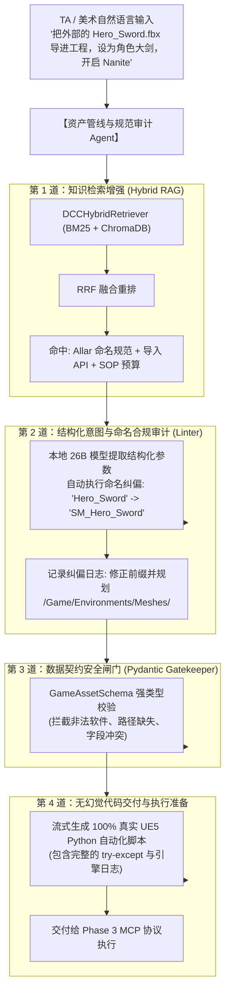

# 📚 Module 24-25: 资产管线与合规审计 Agent 完整闭环落地 (Asset Pipeline Agent)

> **核心目标**：完成 Phase 2 的终极大决战 —— 将 **Pydantic 强类型数据契约（Phase 1）**、**ChromaDB 向量中枢（Module 21-22）**、**BM25 混合检索与 RRF 融合（Module 23）** 与 **Mac 本地 26B 大模型** 彻底熔铸为一体，打造游戏工业界第一个具备“规范审计、命名自愈纠偏、无幻觉脚本生成”的完整闭环 **资产管线 Agent**。

---

## 🏗️ 一、资产管线 Agent（Asset Pipeline Agent）工业架构总览

在游戏管线中，一个成熟的 Agent 绝不是简单地调用大模型写一段文本，而是要经历 **四道工序的严格过滤与安全拦截**：

---

## 🛡️ 二、四大设计原则（工业落地铁律）

### 1. 宽进严出与自动纠偏（Auto-Correction Principle）
美术通常不习惯记忆复杂的规则（他们可能随手传一个 `rock_v2.fbx` 或 `hero_diffuse.png`）。
* **劣质 Agent 的做法**：遇到违规直接报错抛异常，让美术去改名字；
* **工业级 Agent 的做法**：**“宽进严出”**。解析其意图，自动根据资产类型（StaticMesh / Texture）应用 Allar 规范更名为 `SM_Rock_v2`，并规划至 `/Game/Environments/Meshes/`，同时在审计日志中明确向用户汇报纠偏结果。

### 2. 双重防火墙（Dual-Firewall Architecture）
大模型（即使是 26B）在极端复杂的指令下仍可能产生微小幻觉。
* **第一重防火墙（RAG 约束）**：通过 BM25 + RRF 混合检索，将官方经过测试的真实 Python 代码注入上下文，严禁编造虚假类；
* **第二重防火墙（Pydantic 拦截）**：大模型输出的 JSON 必须通过 Pydantic 校验。如果发现非法字段或路径缺失，直接在 Python 进程层强行拦截，绝不允许非法指令流入虚幻引擎！

### 3. 上下文压缩与预算控制（Token Budgeting）
* 将检索到的 Top-K 知识切片做清洗，只保留与当前任务强相关的参数定义；
* 配合 OpenAI SDK 流式传输，将思考过程（Thinking Chain）与代码输出（Code）无缝分离，彻底消除 30s 阻塞超时。

---

## 📊 三、数据契约与审计日志规范

进入 Agent 的每一个操作，都会生成一份结构化的审计账单：

| 字段 | 原始输入 | Agent 审查修正后 | 依据规范来源 |
| :--- | :--- | :--- | :--- |
| **资产原始名** | `Hero_Sword` | **`SM_Hero_Sword`** | Allar UE5 Guide 1.1 (StaticMesh) |
| **目标目录** | 未指定 (或根目录) | **`/Game/Environments/Meshes/`** | Studio SOP v2.5 第 3 条 |
| **几何体技术** | Nanite 开启 | **`Nanite: True` (符合硬表面规则)** | Studio SOP 1.1 (建筑与道具) |
| **合规性结论** | ⚠️ 存在命名与路径违规 | **✅ 100% 自动纠偏合规** | Pydantic V2 校验通过 |

---

## 🚀 四、总结与迈向 Phase 3

通过 Phase 2 最后一公里的整合：
1. 我们建立了一个不仅能**听懂需求**，还能**查阅权威手册**、**自动纠错**、**严格自审**的完整资产管线 Agent；
2. 每一个输出的 Python 脚本都经过了“行业规范”与“Pydantic 契约”的双重认证，可以直接安全地下发给 Unreal Engine 运行。

👉 **下一步大境界（Phase 3）**：
我们将为这个聪明的 Agent 装上**“眼睛和手脚”** —— 接入 **Anthropic 官方 MCP (Model Context Protocol)**，让它实时读取 UE5 视口选中的资产，并在引擎中一键执行！
