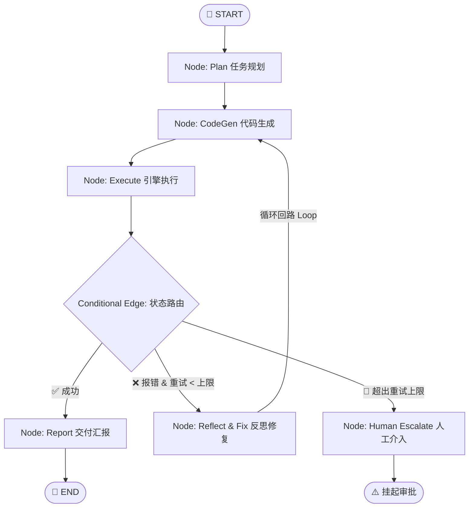

# Module 24: LangGraph 核心状态机与有向有环图编排

## 1. 为什么传统 Chain 不足以胜任游戏工业管线？

在传统 LangChain 或线性工作流中，调用拓扑是一个无环单向图 (DAG: Directed Acyclic Graph)：
$$\text{Prompt} \longrightarrow \text{LLM} \longrightarrow \text{DCC 脚本} \longrightarrow \text{结束}$$

**痛点**：在 Unreal Engine、Maya 或 Houdini 等严谨的 3D DCC 环境中，AI 生成的代码或参数第一次运行时，常常因细微的环境偏差抛出异常（例如缺少导入、参数拼写笔误、目标资产未选中）。线性脚本一旦报错就会直接崩溃抛出 Traceback，流程中断。

**LangGraph 的核心革新**：引入 **有向有环图 (Cyclic StateGraph)**。
允许将“执行报错”作为一种正常的状态流转，带着 Traceback 逆流回到“反思修复节点”，形成自愈循环反馈回路 (Self-Healing Loop)。



---

## 2. LangGraph 1.2+ 核心开发三要素

### 2.1 状态契约 (State & Reducers)
状态是全局共享的数据底座，所有节点只能读取当前 State 并返回增量更新 (Delta)：

```python
from typing import TypedDict, Annotated, List
import operator

class DCCPipelineJobState(TypedDict):
    user_prompt: str
    dcc_target: str
    current_script: str
    is_success: bool
    error_traceback: str
    retry_count: int
    max_retries: int
    # 使用 operator.add 聚合器：新的日志自动 append 追加，不覆盖旧日志
    audit_logs: Annotated[List[str], operator.add]
```

### 2.2 节点函数 (Nodes)
每个节点都是纯 Python 函数，职责单一，返回更新字典：
```python
def execute_node(state: DCCPipelineJobState) -> dict:
    # 模拟执行与异常捕获
    try:
        exec_in_dcc(state["current_script"])
        return {"is_success": True, "error_traceback": ""}
    except Exception as e:
        return {"is_success": False, "error_traceback": str(e)}
```

### 2.3 动态条件边 (Conditional Edges)
路由函数只做决策，不改变状态，返回分支 Key：
```python
def route_execution_result(state: DCCPipelineJobState) -> str:
    if state["is_success"]:
        return "success_flow"
    if state["retry_count"] < state["max_retries"]:
        return "retry_flow"
    return "abort_flow"

# 注册条件边
workflow.add_conditional_edges(
    "execute",
    route_execution_result,
    {
        "success_flow": "report",
        "retry_flow": "reflect_and_fix",
        "abort_flow": "human_escalate",
    }
)
```

---

## 3. 面试与工业实战总结

> [!TIP]
> ### 游戏 TA / Pipeline TD 面试亮点
> * **架构深度**：深入理解 LangGraph 与传统 LangChain 的本质差异（有环状态机 vs 无环 DAG）。
> * **审计合规**：通过 `Annotated[List[str], operator.add]` 全程追踪资产变更的历史审计轨迹 (Audit Trail)，保证生产安全性。
> * **自愈机制**：在工业管线中，容错率不等于 100% 第一次成功，而是具备**“自动化自愈能力（Self-Healing Rate）”**。
