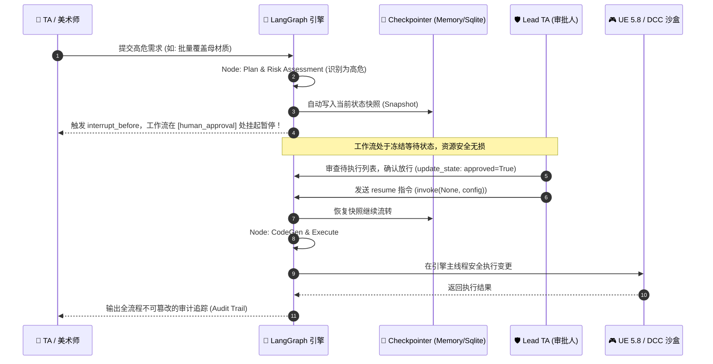

# Module 25-26: LangGraph 状态持久化、自愈闭环与人机审批

## 1. 为什么工业级游戏管线离不开 Checkpointing？

在生产级游戏资产管线中，自动化 Agent 绝不能像聊天机器人一样“单次运行后即忘”：
1. **防灾与高危操作隔离（Destructive Operation Guardrail）**：
   当美术师要求“批量删除关卡中 200 个未引用资产”或“批量重构材质参数”时，AI 绝不能直接静默执行。必须在图执行到危险节点前**自动挂起（Interrupt）**，将状态持久化，等待资深 Lead TA 人工审查依赖树并确认后，再恢复执行。
2. **长耗时任务断点续传（Fault Tolerance & Resume）**：
   全工程数万个资产的夜间烘焙或合规扫描可能耗时数小时。如果中途网络波动或崩溃，有了 Checkpointer 即可根据 `thread_id` 从最近的快照节点（Checkpoint Snapshot）直接恢复，无需从头重算。



---

## 2. 核心技术实现全景

### 2.1 状态快照与线程隔离 (`thread_id`)
通过配置字典中的 `thread_id`，每个美术师或批处理作业拥有独立的状态沙盒：
```python
from langgraph.checkpoint.memory import MemorySaver

checkpointer = MemorySaver()
app = workflow.compile(
    checkpointer=checkpointer,
    interrupt_before=["human_approval"],  # 关键：在此节点前强制拦截挂起！
)

# 专属作业配置
config = {"configurable": {"thread_id": "JOB_2026_0908_001"}}
```

### 2.2 挂起检测与状态快照读取
执行到被拦截节点时，`invoke` 会自然返回，图处于暂停态：
```python
# 运行至拦截点
app.invoke(initial_state, config)

# 获取挂起快照
snapshot = app.get_state(config)
print("当前暂停等待的节点:", snapshot.next)          # [('human_approval',)]
print("待审批操作列表:", snapshot.values["proposed_actions"])
```

### 2.3 人工干预修改状态与断点恢复 (Resume)
通过 `update_state` 注入人工审批结果，再传入 `None` 恢复执行：
```python
# 1. 人工审批通过，更新状态
app.update_state(config, {"human_approved": True})

# 2. 传入 None，图从当前快照无缝恢复执行
final_state = app.invoke(None, config)
```

---

## 3. 面试与工业级架构总结

> [!TIP]
> ### 游戏管线 TD / AI 工程师面试杀手锏
> 1. **全流程不可篡改审计追踪 (Audit Trail)**：
>    通过 `Annotated[List[str], operator.add]` 记录从需求解析、高危风控、审批放行到自愈重试的每一步操作，满足 3A 大厂项目版本控制（Perforce / Git）的合规溯源要求。
> 2. **人机协同最佳范式 (Human-in-the-Loop)**：
>    证明你不仅懂 LLM，更懂游戏生产的“安全边界”——AI 负责繁重的自动化生成与自愈诊断，人类专家把控关键的高危门禁。
