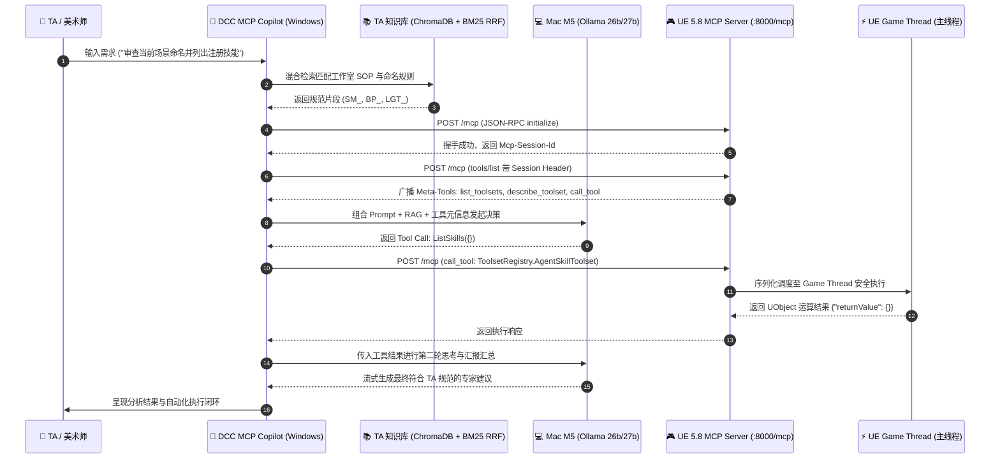

# Module 26-29: Unreal Engine 5.8 原生 MCP 深度对接与 TA Copilot

## 1. 架构总览与核心演进

在 **Unreal Engine 5.8** 中，Epic Games 正式将 **Model Context Protocol (MCP)** 内置为引擎第一公民插件（`ModelContextProtocol` + `Toolset Registry`）。这一重大演进彻底颠覆了以往依靠不稳定 Socket、原生命令行或逆向 HTTP 服务操控引擎的历史。

外挂的 AI Agent（运行在 Windows 宿主机，推理依靠内网私有 Mac M5 算力集群）现在可以通过标准 MCP JSON-RPC 2.0 协议直接操作 UE 5.8 编辑器，所有工具调用均由引擎底层调度器自动安全分发至 **Game Thread（游戏主线程）** 串行执行。



---

## 2. UE 5.8 MCP 通信协议细节（深度解密）

> [!IMPORTANT]
> ### UE 5.8 的 Streamable HTTP JSON-RPC 传输机制
> 1. **监听地址**：默认绑定 `http://127.0.0.1:8000/mcp`。
> 2. **请求方法**：与传统单纯的 GET SSE 长连接不同，UE 5.8 的核心通信通道是标准的 **HTTP POST JSON-RPC 2.0**。直接 GET `/mcp` 会返回 `405 Method Not Allowed`。
> 3. **Session 会话机制（关键）**：
>    * 客户端发起 `initialize` 握手请求后，UE 5.8 会在 HTTP Response Header 中返回 `mcp-session-id: <hex_id>`。
>    * 随后所有的 JSON-RPC 请求（如 `tools/list`、`tools/call`）**必须**在请求头中携带 `Mcp-Session-Id: <hex_id>`，否则服务端会直接拒绝并返回 `-32600 Missing required Mcp-Session-Id header`。

### 初始化握手报文示例

```json
// POST http://127.0.0.1:8000/mcp
{
  "jsonrpc": "2.0",
  "id": 1,
  "method": "initialize",
  "params": {
    "protocolVersion": "2024-11-05",
    "capabilities": {},
    "clientInfo": {
      "name": "dcc-copilot-agent",
      "version": "1.0.0"
    }
  }
}
```

响应头：
```http
HTTP/1.1 200 OK
content-type: application/json;charset=utf-8
mcp-session-id: d6cc0b2a4e52c09c28114bafd5cdefd4
```

---

## 3. Tool Search（元工具发现）模式

为了避免将引擎内数以百计的底层 C++ 与 Python API 一次性全量暴露给大模型从而打爆 Context Window，UE 5.8 默认启用了 **Tool Search 模式**（`bEnableToolSearch = true`）。

该模式对外仅暴露三个一级 Meta-Tools：

| 元工具名称 | 核心职责 | 典型调用参数 |
| :--- | :--- | :--- |
| `list_toolsets` | 枚举当前引擎中已注册的全部工具集（Toolset）列表 | `{}` |
| `describe_toolset` | 按需获取特定工具集内部各个 Tool 的具体入参 JSON Schema | `{"toolset_name": "ToolsetRegistry.AgentSkillToolset"}` |
| `call_tool` | 向指定 Toolset 分发具体工具调用，安全透传至 Game Thread | `{"toolset_name": "...", "tool_name": "...", "arguments": {...}}` |

> [!TIP]
> ### 智能体渐进式发现最佳实践
> 客户端通过 `list_toolsets` 获知引擎能力树后，大模型根据用户意图（如“处理骨骼动画”或“材质优化”）精确锁定对应的 Toolset，发起 `describe_toolset` 加载具体 Schema，实现**毫秒级动态工具按需挂载**。

---

## 4. 在 UE 5.8 中编写自定义 Python Toolset

在工作室研发中，TA 无需编写 C++ 插件，直接在项目目录 `<ProjectRoot>/Content/Python/` 下通过原生注解即可定义业务工具包：

```python
# -*- coding: utf-8 -*-
"""Content/Python/studio_pipeline_toolset.py"""
import unreal
import toolset_registry

@unreal.uclass()
class StudioPipelineToolset(unreal.ToolsetDefinition):
    """工作室资产自动化与场景规范审查工具集。"""

    @toolset_registry.tool_call
    @staticmethod
    def audit_actors_naming(class_filter: str = "") -> dict:
        """根据工作室 SOP 规范审查当前关卡中所有 Actor 的命名。

        Args:
            class_filter: 可选的类名过滤器 (如 StaticMeshActor)。

        Returns:
            包含合规数量、违规列表及自动修复建议的字典。
        """
        all_actors = unreal.EditorLevelLibrary.get_all_level_actors()
        # 执行资产合规逻辑...
        return {"violations_count": 0, "status": "Compliant"}
```

* **热重载方法**：在 UE 5.8 控制台中按 `~` 输入：
  ```text
  ModelContextProtocol.RefreshTools
  ```
  即可在不重启引擎的情况下即时重载工具定义。

---

## 5. 求职与项目包装价值（TA / Pipeline TD 核心竞争力）

> [!TIP]
> ### 面试官技术深挖点对齐
> 1. **跨进程线程安全**：
>    * *问题*：外部 Python 脚本通过 HTTP 控制引擎为什么不会导致 UE 崩溃？
>    * *回答*：UE 5.8 MCP 的核心底层机制在于**请求串行调度器（Core Ticker / Game Thread Serializer）**。外部并发的 JSON-RPC 请求全部在 HTTP 接收层被挂起，由主引擎 Tick 周期依次在 Game Thread 上单线程出队执行，杜绝了 UObject 跨线程竞态条件。
> 2. **协议前沿性与稀缺性**：
>    * 相比过去 99% 候选人所用的 `Remote Execution` 裸套接字，本项目基于 2026 最新的 Anthropic MCP 协议标准与 Epic 官方 `ModelContextProtocol` 架构构建，直接具备了**企业级可插拔 Agent Copilot 架构**的成熟度。
