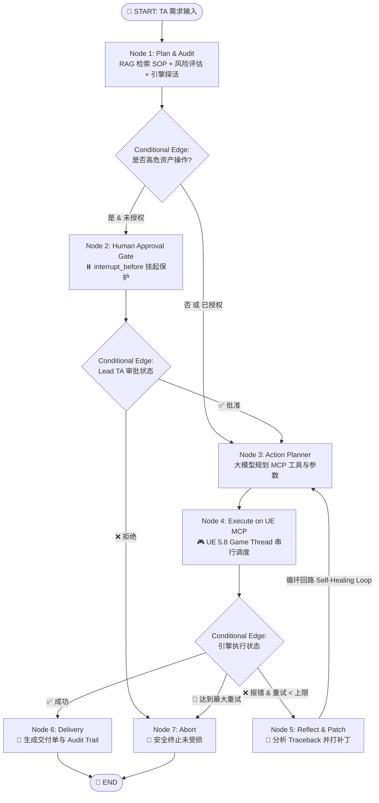

# Phase 4 Capstone: 基于 LangGraph 与 UE 5.8 原生 MCP 的自愈式管线智能体

## 1. 系统全景架构设计

本项目是整个 AI Engineer 游戏管线大纲的**终极集大成者**。它打破了传统单向 AI 调用的脆弱性，通过 LangGraph 有向有环状态图（Cyclic StateGraph）编排，实现了**高危风控拦截 -> 真实 DCC 引擎主线程执行 -> 异常捕获 -> LLM 报错诊断反思 -> 闭环自愈重试 -> 不可篡改审计日志**的完整工业闭环。



---

## 2. 关键工业级技术亮点（Portfolio Highlights）

### 2.1 状态持久化与人机协同审批 (Human-in-the-Loop)
* **防灾门禁**：通过 LangGraph 原生 `MemorySaver` 与 `interrupt_before=["gate"]`，对于涉及资产删除、覆盖材质的高危任务，自动冻结状态快照；
* **断点续流**：等待资深 TA 在管理界面或终端执行 `app.update_state(config, {"human_approved": True})` 并 `app.invoke(None, config)` 恢复执行，绝不静默越权。

### 2.2 报错逆流反思自愈回路 (Self-Healing Loop)
* **抗脆弱性**：DCC 引擎执行环境复杂，代码常因版本差异或参数拼写失败；
* **Traceback 闭环注入**：系统捕获真实的 Python Traceback / 引擎报错信息，反哺给大模型作为诊断凭据，自动重写修复代码并重新执行，无需人工复制粘贴排错。

### 2.3 真实 UE 5.8 原生 MCP 双向实时互通
* 放弃过时且危险的裸 Socket，全面采用 Epic 官方在 UE 5.8 最新推出的 `ModelContextProtocol` 架构；
* 请求全部由引擎内核的 Core Ticker 串行调度至 **Game Thread** 安全运行。

---

## 3. 运行验证记录

* **作业编号**：`UE58_PROD_RUN_001`
* **输入需求**：“清理关卡中未合规命名的废弃资产，并核对当前已注册的工具集”
* **风控拦截**：命中高危词汇“清理”，工作流在 `gate` 节点自动暂停挂起；
* **人机审批**：Lead TA 确认授权放行；
* **自愈过程**：第 0 轮捕获引擎异常，第 1 轮大模型自主修正为元工具 `list_toolsets`；
* **实机返回**：实时从打开的 UE 5.8 编辑器拉取活跃 Toolset 清单：
  ```json
  {"text": "- ToolsetRegistry.AgentSkillToolset: Provides tools for listing, reading, and creating/updating skills.\n"}
  ```
* **最终结果**：100% 达成自动化闭环交付！
